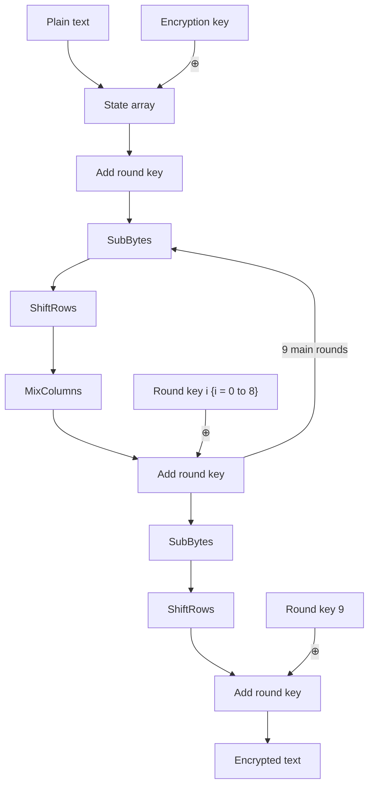

AES a symmetric block cipher that can process data blocks of 128 bits (16 bytes), using cipher keys with lengths of 128, 192, and 256 bits, which comes into the term of AES-128, AES-192 and AES-256 to indicate the length of the key.

With the message to be encrypted by AES smaller than 16 bytes, padding technique is required.

# Flowchart

