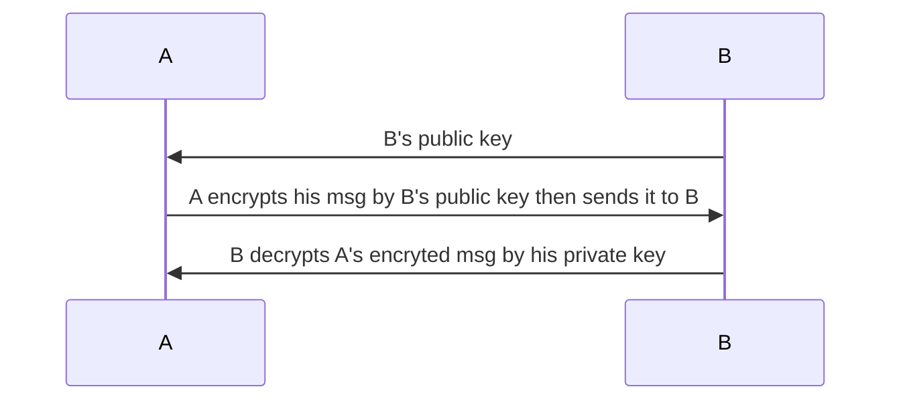

Cryptographic techniques allow a sender to disguise data so that an intruder can gain no information from the intercepted data. The receiver, of course, must be able to recover the original data from the disguised data.

# Public key encryption
Public key encryption is the encryption method which uses a public key to encrypt the message then use the private key to decrypt that encrypted message.

In private key encryption, initially, B keep his own private key in order to decrypt the message encrypted by his public key which he sends to A. However, public key encryption algorithm, e.g RSA, supports encrypting the message by the private key and decrypting that encrypted message by the public key.

# Cryptographic hash function
A cryptographic hash function takes an input, m, and computes a fixed size string H(m) known as a hash. Checksum and CRCs meet this definition. A cryptographic hash function is also required to be computationally infeasible to find any two different messages x and y such that H(x) = H(y).

Cryptographic hash function can be used for both error correction code and digital signature. Famous cryptographic hash function are:
* CRC
* Checksum
* MD5
* SHA
