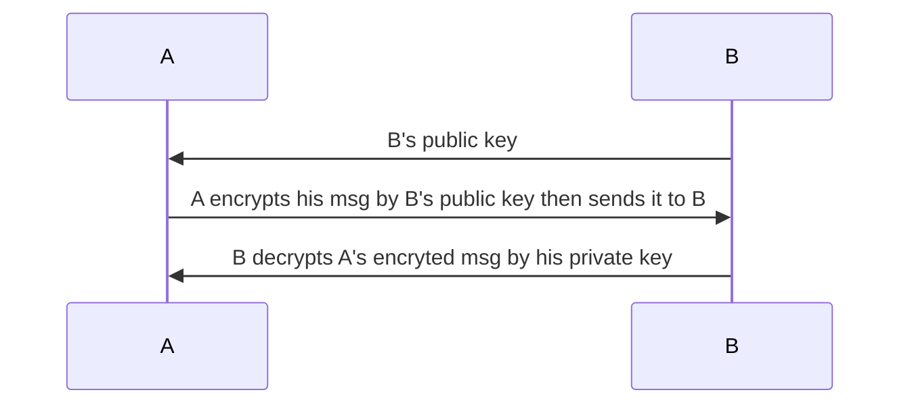
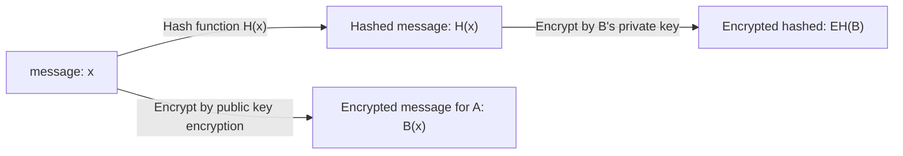
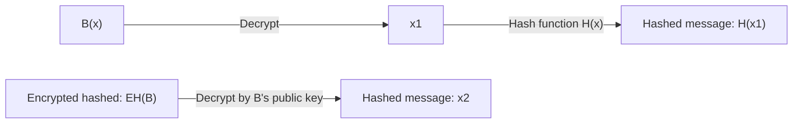

Cryptographic techniques allow a sender to disguise data so that an intruder can gain no information from the intercepted data. The receiver, of course, must be able to recover the original data from the disguised data.

# Public key encryption
Public key encryption is the encryption method which uses a public key to encrypt the message then use the private key to decrypt that encrypted message.

In private key encryption, initially, B keep his own private key in order to decrypt the message encrypted by his public key which he sends to A. However, public key encryption algorithm, e.g RSA, supports encrypting the message by the private key and decrypting that encrypted message by the public key.

# Cryptographic hash function
A cryptographic hash function takes an input, m, and computes a fixed size string H(m) known as a hash. Checksum and CRCs meet this definition. A cryptographic hash function is also required to be computationally infeasible to find any two different messages x and y such that H(x) = H(y).

Cryptographic hash function can be used for both error correction code and digital signature. Famous cryptographic hash function are:
* CRC
* Checksum
* MD5
* SHA
# Digital signature
Form the communication between A (who keeps B's public key) and B (who keeps the private key), B nees to prove that he is the real B, not someone pretends to be B. That can be acheived by using digital signature.

For B communication with A by using public key encryption, there can be 2 ways:
* A sends B his public key while he keeps his own private key. B to A communication will then follow the encryption flow like from A to B.
* B encrypts his message by his private key then sends to A. A decrypts that encrypted message by B's public key. That's way is not secure as a man-in-the-middle, who had B's public key before can decrypt B's encrypted message.

For digital signature, suppose that A and B has already setup a secure communication channel, in order for B to prove to A he's really B, the digital signature will take the following flow in B's side:

* Hash function: MD5, SHA,...
* To encrypt the hashed message H(x) by B's private key, the same public key encryption algo like RSA or other algo like DSA (digital signature algorithm) can be used.
* **EH(B)** denotes the encrypted hash message as the digital message of B.
* **B(x)** denotes the encrypted message from the orignal one ``x`` that B wants to send to A. The encryption method for B(x) are 2 ways mention earlier.

In A's side, A receives B(x) then decrypts it to get a message named H(x1). A also receives EH(B) then decrypts it by B's public key to have the message named x2. If H(x1) = x2, the message is actually signed by B as B is the only people to have his private key which is used to encrypt the message ``x``. The full flow for A to verify the digital signature will be:

# Public Key Certification
Continue with the digital signature above where A is a customer and B is a bank. Suppose that initially, A init this whole digital signature process with B is a fraudulent bank, who pretends to be a real bank. By just basing on the public key, A has no way to know that. That's why Public Key Certification comes into play.

Binding a public key to a particular entity is typically done by a **Certification Authority** (**CA**), whose job is to validate identities and issue certificates. A CA has the following roles:
1. A CA verifies that an entity (a person, a router, and so on) is who it says it is. There are no mandated procedures for how certification is done. When dealing with a CA, one must trust the CA to have performed a suitably rigorous identity verification
2. Once the CA verifies the identity of the entity, the CA creates a certificate that binds the public key of the entity to the identity. The certificate contains the public key and globally unique identifying information about the owner of the public key (for example, a human name or an IP address). The certificate is digitally signed by the CA.

Public key certification is used in many popular secure networking protocols, including IPsec and SSL.
